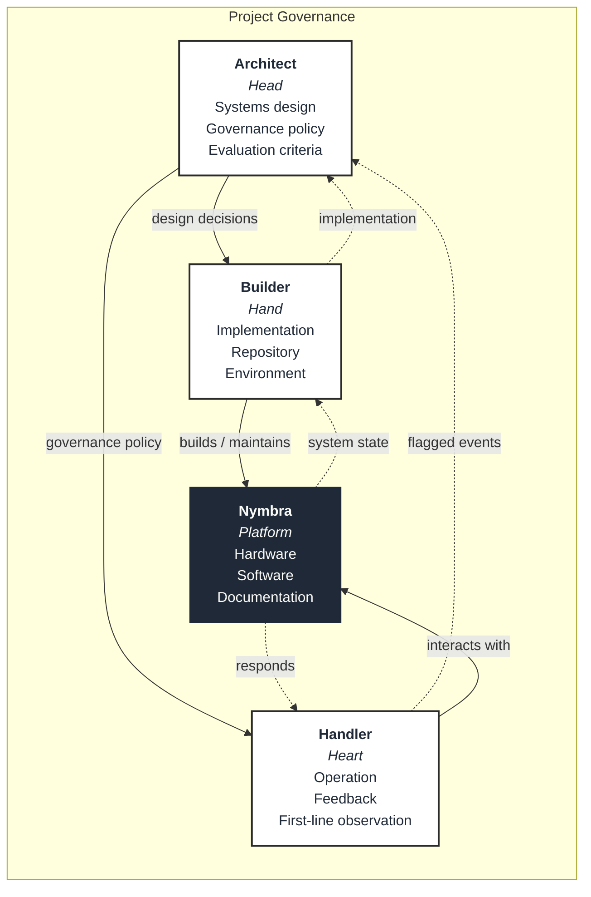
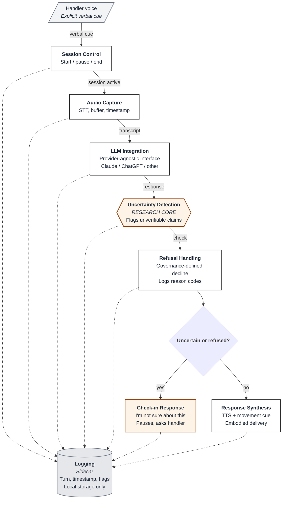

# Nymbra Architecture Diagrams — Mermaid Versions

These are text-based alternatives to the SVG diagrams in this directory. They render automatically on GitHub and in most Markdown viewers. Use these if you prefer editing diagrams in text, or embed them directly in other Markdown files.

---

## Context Diagram (Four-Role Framework)

---

## Component Diagram (Conversation Turn Data Flow)

---

## Which version to use

Both the SVG and Mermaid versions describe the same architecture. Choose based on where the diagram needs to live:

- **SVG** — when embedding in documentation, presentations, or when visual refinement matters (portfolio pages, blog posts, slide decks). Edit the source directly or regenerate from Claude.
- **Mermaid** — when the diagram lives in Markdown, needs to be diffable in pull requests, or when multiple contributors will edit it over time. Renders automatically on GitHub.

For this project, the SVGs are the canonical versions (they live at `context.svg` and `components.svg` in this directory). The Mermaid versions exist as backups and for easy embedding in other Markdown files across the repository.
